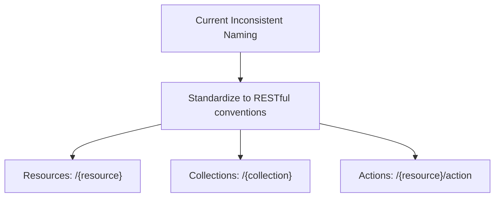
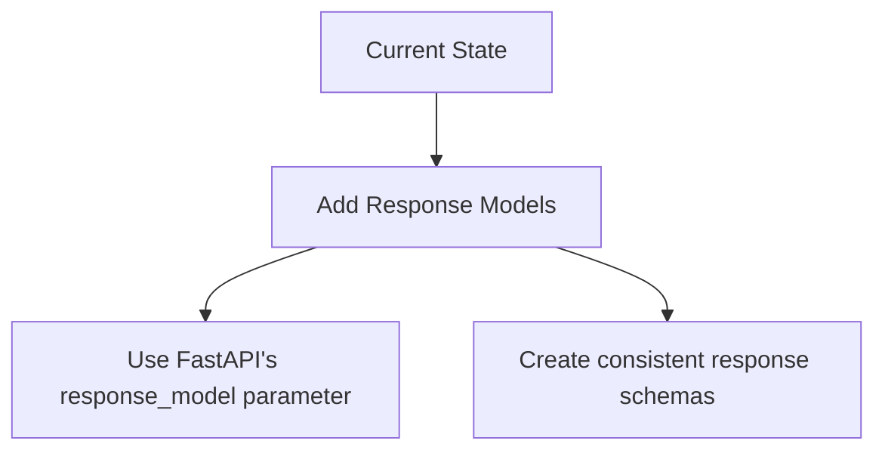
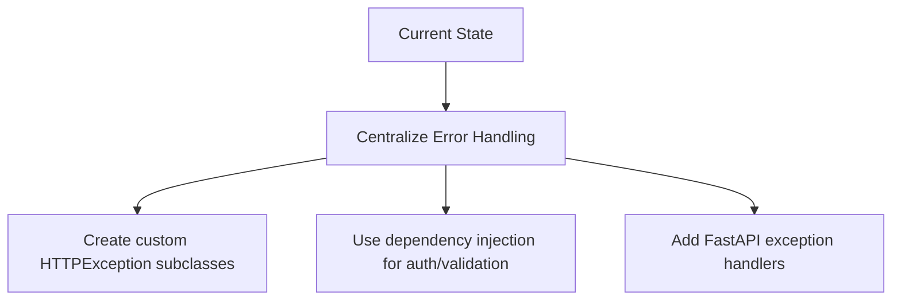
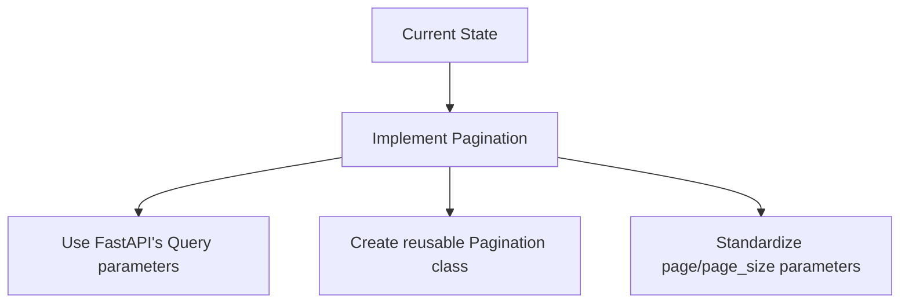
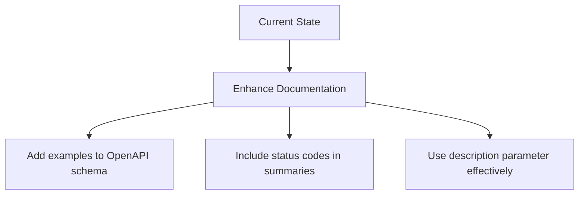

# API Architecture Review and Improvement Plan

## Executive Summary

This document provides a comprehensive architectural review of the current API design and endpoints structure, with RFC 7807 (Problem Details for HTTP APIs) compliance as a key requirement.

---

## Current Architecture Analysis

### Strengths ✅

1. **Modular Organization**: Endpoints are well-separated by domain:
   - [`partner_api.py`](src/api/v1/endpoints/partner_api.py): Partner management
   - [`shop_api.py`](src/api/v1/endpoints/shop_api.py): Shop management  
   - [`inventory_api.py`](src/api/v1/endpoints/inventory_api.py): Inventory and device management
   - [`clark_api.py`](src/api/v1/endpoints/clark_api.py): Staff management
   - [`purchase_api.py`](src/api/v1/endpoints/purchase_api.py): Purchase orders
   - [`dict_api.py`](src/api/v1/endpoints/dict_api.py): Dictionary/data management
   - [`default_identity_api.py`](src/api/v1/endpoints/default_identity_api.py): User identity management

2. **Versioned API Structure**: All endpoints use `/api/v1` prefix for clear versioning

3. **Central Router Pattern**: All v1 endpoints are aggregated in [`router.py`](src/api/v1/router.py)

4. **FastAPI Best Practices**: Proper use of routers, dependencies, and response models

5. **Tag-based Documentation**: Each endpoint has clear tags for API documentation grouping

6. **Response Model Usage**: Many endpoints properly define response models (e.g., `response_model=StaffResponse`)

7. **Pagination Implementation**: Some list endpoints already implement pagination (e.g., purchase_api.py line 29-30)

---

## RFC 7807 Compliance Requirements

RFC 7807 defines a standardized format for error responses using the `application/problem+json` media type.

### Required Structure:
```json
{
  "type": "https://example.com/errors/invalid-parameter",
  "title": "Invalid parameter value",
  "status": 400,
  "detail": "The value provided for 'sort' is invalid.",
  "instance": "/orders?sort=invalid"
}
```

### Key Fields:
- `type`: URI reference that identifies the problem type (should be stable)
- `title`: Short, human-readable summary of the problem
- `status`: HTTP status code
- `detail`: Human-readable explanation specific to this occurrence
- `instance` (optional): URI reference that identifies specific occurrence

---

## Issues and Recommendations

### 1. Endpoint Naming Inconsistency 🔄

**Current State**: Mixed naming patterns across endpoints:
- `POST /create` (shop_api.py:25, clark_api.py:34)
- `POST /device/add` (inventory_api.py:60)
- `POST /device/add-detailed` (inventory_api.py:226)
- `PUT ""` (clark_api.py:122) - Empty path
- `DELETE /{target_shop_id}` (shop_api.py:88)

**Recommendation**: Standardize to RESTful conventions:



**Implementation**:
- **Create**: `POST /shops` (not `/create`)
- **Read**: `GET /shops/{id}`
- **Update**: `PUT /shops/{id}`
- **Delete**: `DELETE /shops/{id}`
- **Custom actions**: `POST /shops/{id}/activate` or `PATCH /shops/{id}/status`

**Files to Update**:
- [`shop_api.py`](src/api/v1/endpoints/shop_api.py): Lines 25, 88, 112, 206, 280
- [`inventory_api.py`](src/api/v1/endpoints/inventory_api.py): Lines 60, 226, 361, 750, 941, 996, 1033, 1140
- [`clark_api.py`](src/api/v1/endpoints/clark_api.py): Lines 34, 122, 212, 316, 373
- [`partner_api.py`](src/api/v1/endpoints/partner_api.py): Lines 14, 45, 88

---

### 2. Response Model Standardization 📋

**Current State**: Some endpoints lack explicit response models:
- `get_inventory_list` (inventory_api.py:750) - No response_model specified
- `search_inventory_by_sn` (inventory_api.py:826) - No response_model
- `get_sales_detail` (inventory_api.py:869) - No response_model
- `update_inventory_status` (inventory_api.py:996) - No response_model

**Recommendation**:


**Implementation**:
1. Create standardized response models in `src/model/response_models.py`
2. Add `response_model` parameter to all endpoints
3. Ensure all responses follow consistent structure with `code`, `message`, and `data` fields
4. **RFC 7807 Compliance**: Create `ProblemDetails` base model for error responses

---

### 3. Error Handling Strategy 🛡️

**Current State**: Error handling is embedded within endpoint functions:
- Try-catch blocks in each endpoint (e.g., clark_api.py:94-106, shop_api.py:39-55)
- Mixed use of `HTTPException` and custom exceptions
- No centralized error handling middleware

**Recommendation**:


**Implementation**:
1. Create `src/common/exceptions.py` with standardized exceptions
2. Add RFC 7807 compliant error responses
3. Add exception handlers in main app.py
4. Use dependency injection for authentication and validation
5. Extract common error handling logic into utilities

---

### 4. Pagination Strategy 📄

**Current State**: 
- Some endpoints implement pagination (purchase_api.py:29-30)
- Others don't (inventory list endpoints)
- Inconsistent pagination parameters across endpoints

**Recommendation**:


**Implementation**:
1. Create `Pagination` base class with standard parameters
2. Apply to all list endpoints:
   - `/inventory/list` (inventory_api.py:750)
   - `/device/options` (inventory_api.py:1140)
3. Ensure consistent parameter names and defaults

---

### 5. Documentation Enhancement 📚

**Current State**: Some endpoints have minimal documentation:
- Missing `summary` in some endpoints
- No examples in OpenAPI schema
- Inconsistent status code documentation

**Recommendation**:


**Implementation**:
1. Add `summary` and `description` to all endpoints
2. Include response examples using FastAPI's `Examples`
3. Document possible error responses with status codes
4. Use tags consistently for grouping related endpoints

---

## RFC 7807 Implementation Plan

### Problem Details Base Model:
```python
from pydantic import BaseModel
from typing import Optional

class ProblemDetails(BaseModel):
    type: str
    title: str
    status: int
    detail: str
    instance: Optional[str] = None
```

### Error Response Examples:

**400 Bad Request**:
```json
{
  "type": "https://api.example.com/errors/invalid-input",
  "title": "Invalid Input",
  "status": 400,
  "detail": "The provided phone number format is invalid.",
  "instance": "/partners/search?phone=123"
}
```

**401 Unauthorized**:
```json
{
  "type": "https://api.example.com/errors/unauthorized",
  "title": "Unauthorized",
  "status": 401,
  "detail": "Authentication credentials are required.",
  "instance": "/shops/current"
}
```

**403 Forbidden**:
```json
{
  "type": "https://api.example.com/errors/forbidden",
  "title": "Forbidden",
  "status": 403,
  "detail": "You do not have permission to delete this shop.",
  "instance": "/shops/123"
}
```

**404 Not Found**:
```json
{
  "type": "https://api.example.com/errors/not-found",
  "title": "Not Found",
  "status": 404,
  "detail": "Shop with ID 123 does not exist.",
  "instance": "/shops/123"
}
```

**500 Internal Server Error**:
```json
{
  "type": "https://api.example.com/errors/server-error",
  "title": "Internal Server Error",
  "status": 500,
  "detail": "An unexpected error occurred while processing your request.",
  "instance": "/inventory/list"
}
```

---

## Implementation Roadmap

### Phase 1: Foundation (2-3 days)
1. ✅ Analyze current architecture
2. ✅ Identify all issues and opportunities
3. Create standardized response models (including RFC 7807 ProblemDetails)
4. Implement centralized error handling with RFC 7807 compliance
5. Define error type URIs and documentation

### Phase 2: Endpoint Refactoring (4-6 days)
1. Standardize endpoint naming across all modules
2. Add response models to all endpoints
3. Implement consistent pagination
4. Enhance API documentation with RFC 7807 examples
5. Update error responses to use ProblemDetails format

### Phase 3: Testing and Validation (3 days)
1. Write integration tests for refactored endpoints
2. Validate OpenAPI schema generation
3. Test RFC 7807 compliance with API clients
4. Performance testing
5. Documentation review

---

## Files Impacted

| File | Changes Required |
|------|-----------------|
| [`shop_api.py`](src/api/v1/endpoints/shop_api.py) | Endpoint naming, response models, RFC 7807 errors |
| [`inventory_api.py`](src/api/v1/endpoints/inventory_api.py) | Endpoint naming, pagination, response models, RFC 7807 errors |
| [`clark_api.py`](src/api/v1/endpoints/clark_api.py) | Endpoint naming, documentation, RFC 7807 errors |
| [`partner_api.py`](src/api/v1/endpoints/partner_api.py) | Response models, documentation, RFC 7807 errors |
| [`purchase_api.py`](src/api/v1/endpoints/purchase_api.py) | Documentation enhancement, RFC 7807 errors |
| [`dict_api.py`](src/api/v1/endpoints/dict_api.py) | Response model consistency, RFC 7807 errors |
| `app.py` | Centralized error handling with RFC 7807 compliance |
| `src/model/response_models.py` | New standardized response models including ProblemDetails |
| `src/common/exceptions.py` | Custom exception classes with RFC 7807 support |

---

## Success Metrics

1. **Consistency**: All endpoints follow same naming and documentation patterns
2. **Type Safety**: 100% of endpoints have explicit response models
3. **RFC 7807 Compliance**: All error responses use ProblemDetails format
4. **Documentation**: Complete OpenAPI schema with examples
5. **Maintainability**: Clear separation of concerns, reusable components
6. **Developer Experience**: Intuitive API structure for frontend consumers

---

## Next Steps

1. Review this plan and provide feedback
2. Prioritize which improvements to implement first
3. Switch to code mode to begin implementation
4. Implement changes incrementally with proper testing

Would you like me to switch to code mode to begin implementing these improvements?
