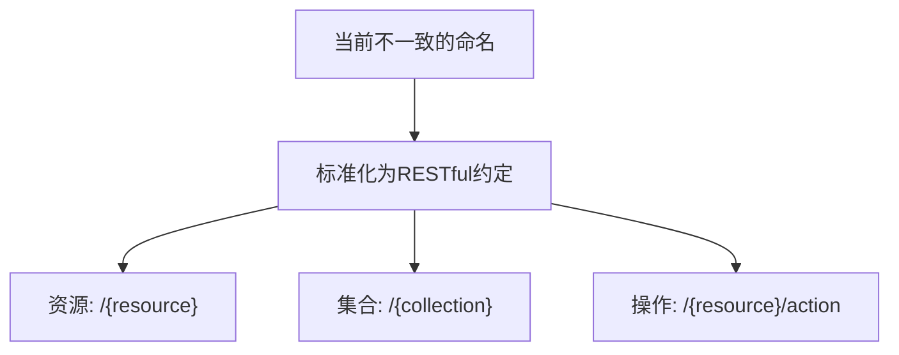
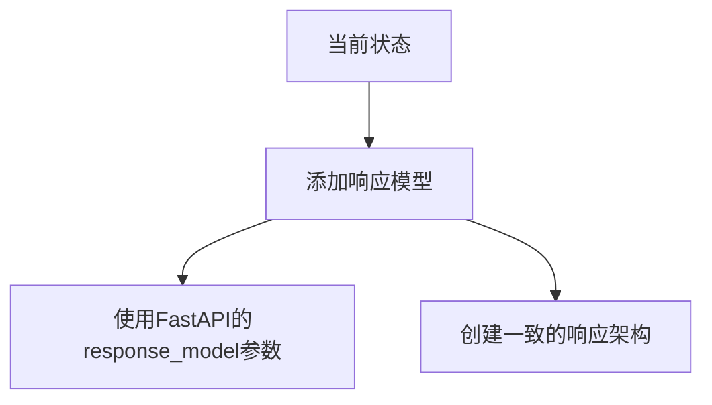
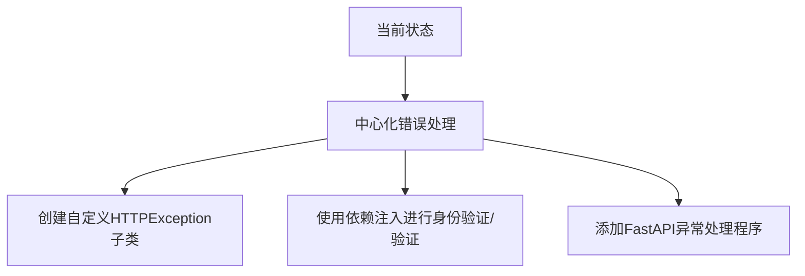
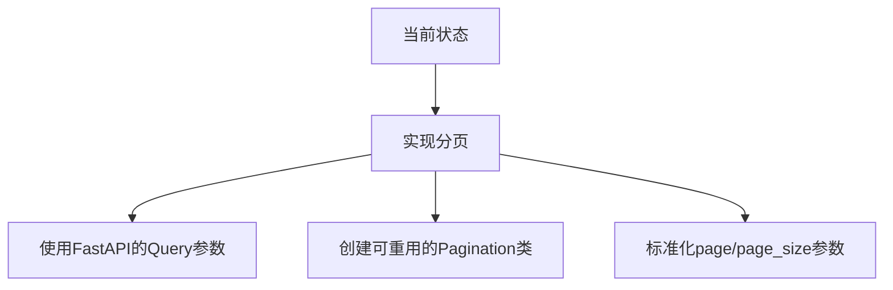
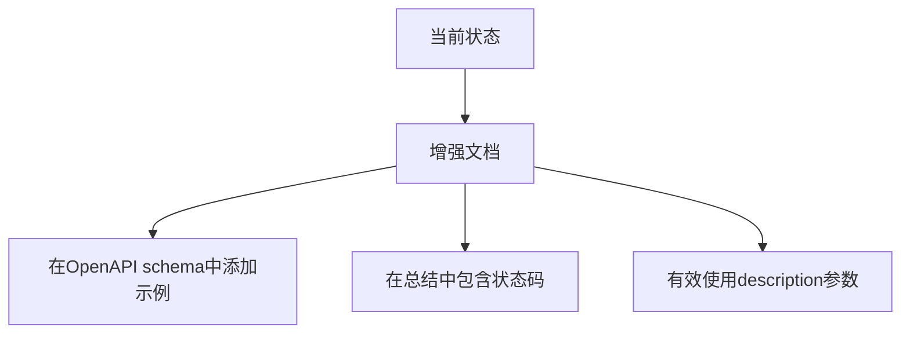

# API架构评审与改进计划

## 概述

本文档提供了当前API设计和端点结构的全面架构评审，并附带可行的改进建议。

---

## 当前架构分析

### 优点 ✅

1. **模块化组织**：按域将端点分离：
   - [`partner_api.py`](src/api/v1/endpoints/partner_api.py)：合作伙伴管理
   - [`shop_api.py`](src/api/v1/endpoints/shop_api.py)：门店管理  
   - [`inventory_api.py`](src/api/v1/endpoints/inventory_api.py)：库存和设备管理
   - [`clark_api.py`](src/api/v1/endpoints/clark_api.py)：员工管理
   - [`purchase_api.py`](src/api/v1/endpoints/purchase_api.py)：采购订单
   - [`dict_api.py`](src/api/v1/endpoints/dict_api.py)：字典/数据管理
   - [`default_identity_api.py`](src/api/v1/endpoints/default_identity_api.py)：用户身份管理

2. **版本化API结构**：所有端点使用`/api/v1`前缀进行清晰的版本控制

3. **中心路由模式**：所有v1端点在[`router.py`](src/api/v1/router.py)中聚合

4. **FastAPI最佳实践**：正确使用路由器、依赖项和响应模型

5. **基于标签的文档**：每个端点都有清晰的标签用于API文档分组

6. **响应模型使用**：许多端点正确定义了响应模型（例如`response_model=StaffResponse`）

7. **分页实现**：一些列表端点已经实现了分页（例如purchase_api.py第29-30行）

---

## 问题及建议

### 1. 端点命名不一致 🔄

**当前状态**：端点之间的命名模式混合：
- `POST /create` (shop_api.py:25, clark_api.py:34)
- `POST /device/add` (inventory_api.py:60)
- `POST /device/add-detailed` (inventory_api.py:226)
- `PUT ""` (clark_api.py:122) - 空路径
- `DELETE /{target_shop_id}` (shop_api.py:88)

**建议**：标准化为RESTful约定：

**实施**：
- **创建**：`POST /shops`（不是`/create`）
- **读取**：`GET /shops/{id}`
- **更新**：`PUT /shops/{id}`
- **删除**：`DELETE /shops/{id}`
- **自定义操作**：`POST /shops/{id}/activate`或`PATCH /shops/{id}/status`

**需要更新的文件**：
- [`shop_api.py`](src/api/v1/endpoints/shop_api.py)：第25、88、112、206、280行
- [`inventory_api.py`](src/api/v1/endpoints/inventory_api.py)：第60、226、361、750、941、996、1033、1140行
- [`clark_api.py`](src/api/v1/endpoints/clark_api.py)：第34、122、212、316、373行
- [`partner_api.py`](src/api/v1/endpoints/partner_api.py)：第14、45、88行

---

### 2. 响应模型标准化 📋

**当前状态**：一些端点缺少显式的响应模型：
- `get_inventory_list` (inventory_api.py:750) - 没有指定response_model
- `search_inventory_by_sn` (inventory_api.py:826) - 没有response_model
- `get_sales_detail` (inventory_api.py:869) - 没有response_model
- `update_inventory_status` (inventory_api.py:996) - 没有response_model

**建议**：

**实施**：
1. 在`src/model/response_models.py`中创建标准化的响应模型
2. 为所有端点添加`response_model`参数
3. 确保所有响应都遵循一致的结构，包含`code`、`message`和`data`字段

---

### 3. 错误处理策略 🛡️

**当前状态**：错误处理内嵌在端点函数中：
- 每个端点都有try-catch块（例如clark_api.py:94-106, shop_api.py:39-55）
- 混合使用`HTTPException`和自定义异常
- 没有中心化的错误处理中间件

**建议**：

**实施**：
1. 创建`src/common/exceptions.py`，包含标准化的异常
2. 在main app.py中添加异常处理程序
3. 对身份验证和验证使用依赖注入
4. 提取通用的错误处理逻辑到实用工具中

---

### 4. 分页策略 📄

**当前状态**：
- 一些端点实现了分页（purchase_api.py:29-30）
- 其他端点没有（库存列表端点）
- 不同端点之间的分页参数不一致

**建议**：

**实施**：
1. 创建带有标准参数的`Pagination`基类
2. 应用到所有列表端点：
   - `/inventory/list` (inventory_api.py:750)
   - `/device/options` (inventory_api.py:1140)
3. 确保参数名称和默认值一致

---

### 5. 文档增强 📚

**当前状态**：一些端点的文档不完整：
- 一些端点缺少`summary`
- OpenAPI schema中没有示例
- 状态码文档不一致

**建议**：

**实施**：
1. 为所有端点添加`summary`和`description`
2. 使用FastAPI的`Examples`添加响应示例
3. 记录可能的错误响应及状态码
4. 一致地使用标签进行相关端点分组

---

## 实施路线图

### 阶段1：基础（1-2天）
1. ✅ 分析当前架构
2. ✅ 识别所有问题和机会
3. 创建标准化的响应模型
4. 实现中心化的错误处理

### 阶段2：端点重构（3-5天）
1. 在所有模块中标准化端点命名
2. 为所有端点添加响应模型
3. 实现一致的分页
4. 增强API文档

### 阶段3：测试和验证（2天）
1. 为重构后的端点编写集成测试
2. 验证OpenAPI schema生成
3. 性能测试
4. 文档审查

---

## 受影响的文件

| 文件 | 需要的更改 |
|------|-----------|
| [`shop_api.py`](src/api/v1/endpoints/shop_api.py) | 端点命名、响应模型 |
| [`inventory_api.py`](src/api/v1/endpoints/inventory_api.py) | 端点命名、分页、响应模型 |
| [`clark_api.py`](src/api/v1/endpoints/clark_api.py) | 端点命名、文档 |
| [`partner_api.py`](src/api/v1/endpoints/partner_api.py) | 响应模型、文档 |
| [`purchase_api.py`](src/api/v1/endpoints/purchase_api.py) | 文档增强 |
| [`dict_api.py`](src/api/v1/endpoints/dict_api.py) | 响应模型一致性 |
| `app.py` | 中心化错误处理 |
| `src/model/response_models.py` | 新的标准化响应模型 |
| `src/common/exceptions.py` | 自定义异常类 |

---

## 成功指标

1. **一致性**：所有端点遵循相同的命名和文档模式
2. **类型安全**：100%的端点有显式响应模型
3. **文档**：完整的OpenAPI schema，包含示例
4. **可维护性**：清晰的职责分离，可重用组件
5. **开发者体验**：直观的API结构供前端消费

---

## 下一步行动

1. 审阅此计划并提供反馈
2. 优先确定要首先实施的改进
3. 切换到代码模式开始实施
4. 分阶段实施更改，并进行适当测试

您是否希望我切换到代码模式开始实施这些改进？
